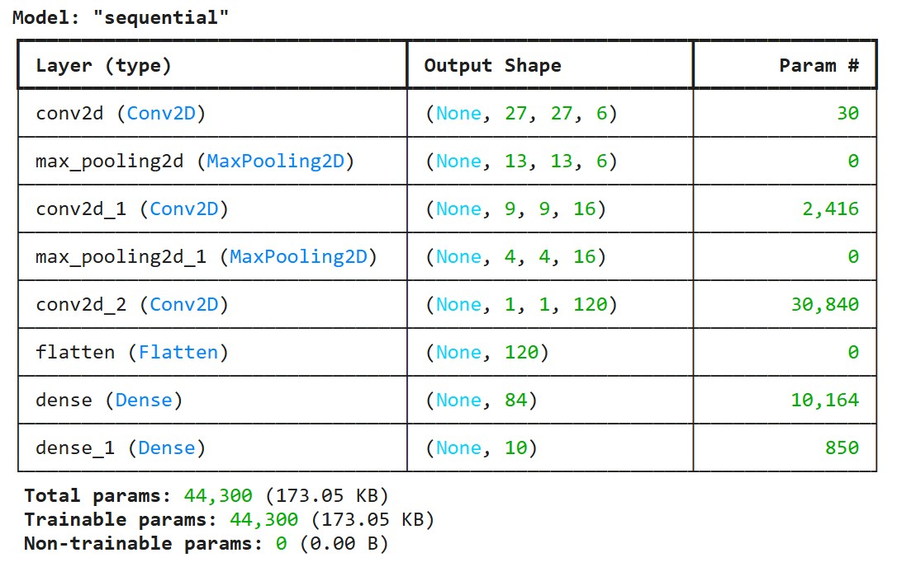
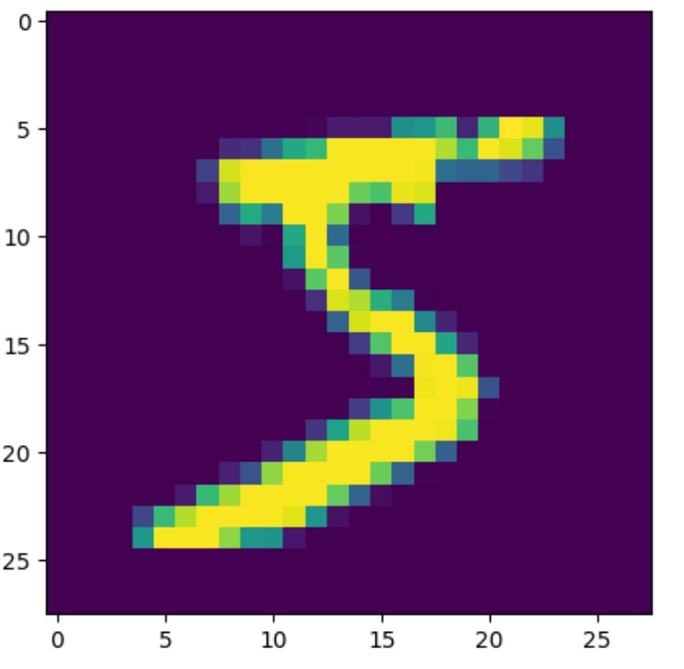

# Handwritten Digit Classification with LeNet-5 Inspired CNN on MNIST
To built a compact LeNet-5 Convolutional Neural Network (CNN) using TensorFlow/Keras to classify handwritten digits from the MNIST dataset. The project includes data preprocessing, model architecture design, training, and performance evaluation—demonstrating a practical deep learning workflow for image classification.

### Basic Information

* **Person or organization developing model**: Patrick Hall, `jphall@gwu.edu` & N M Emran Hussain `nmemran.hussain@gwu.edu`
* **Model date**: June, 2025
* **Model version**: 1.0 
* **License**: [Apache License 2.0](https://github.com/nmemranhussain/6290_PAI_2/blob/main/LICENSE)
* **Model implementation code**: [Assignment_3](https://github.com/nmemranhussain/6290_PAI_2/blob/main/Assignment_3_final.ipynb), 

### Intended Use
* **Primary intended uses**: This project is designed as an educational and practical exercise in applying deep learning techniques to image classification tasks. Specifically, it aims to help learners understand how convolutional neural networks (CNNs)—inspired by the LeNet-5 architecture—can be built, trained, and evaluated using real-world datasets like MNIST. It demonstrates key steps such as data preprocessing, network design using TensorFlow/Keras, and performance evaluation, making it suitable for students, early practitioners, or anyone exploring computer vision fundamentals.
* **Out-of-scope use cases**: This project is not intended for production deployment or use in real-time digit recognition systems. It does not include advanced features like hyperparameter tuning, model optimization for edge devices, or comparison across multiple deep learning architectures. Additionally, it does not address scalability, adversarial robustness, or explainability in model predictions—topics that are essential for deploying CNNs in safety-critical or commercial applications.

### Training Data

* Data dictionary:

| Field Name | Description | Data Type | Example |  
|-----------|--------------|------------|----------|
| x_train	| Training images grayscale pixel values of handwritten digits (0–9) | ndarray (60000, 28, 28, 1) |	28×28 pixel matrix |  
| y_train	| Training labels; corresponding digit class for each image	| ndarray (60000, ) before encoding (60000, 10) after one-hot encoding	| 5 or [0,0,0,0,0,1,0,0,0,0] |  
| x_test	| Test images; grayscale pixel values of handwritten digits (0–9)	| ndarray (10000, 28, 28, 1) | 28×28 pixel matrix |  
| y_test	| Test labels; digit class for each test image	| ndarray (10000, ) before encoding (10000, 10) after one-hot encoding | 2 or [0,0,1,0,0,0,0,0,0,0]|  
| pixel values	| Intensity values ranging from 0 (black) to 255 (white), later normalized to [0,1]	| float32 after normalization	| 0.00 – 1.00 |  

* **Source of training data**: [MNIST Datasets (train-images-idx3-ubyte.gz: training set images (9912422 bytes)
train-labels-idx1-ubyte.gz: training set labels (28881 bytes))](https://www.kaggle.com/datasets/hojjatk/mnist-dataset) 
* **How training data was divided into training and validation data**: 90% training, 10% validation.
* **Number of rows in training data**: 60,000 rows of 28×28 grayscale images and 784 features
* **Validation data**: 6,000 images of 28×28 grayscale images and 784 features
  
### Test Data
* **Source of test data**: [MNIST Datasets (t10k-images-idx3-ubyte.gz: test set images (1648877 bytes)
t10k-labels-idx1-ubyte.gz: test set labels (4542 bytes))](https://www.kaggle.com/datasets/hojjatk/mnist-dataset) 
* **Test Set**: 10,000 rows, each with 784 pixel features if flattened, or (28, 28, 1) shape
* **Any differences in columns between training and test data**: The test set is completely separate from training data—no overlap.

### Model details
* **Input pixel grid in the final model**: pixel values of the 2-D array of grayscale images, specifically: 28 × 28 × 1 with value range (0.0, 1.0)
* **Target(s) output in the final model**: One-hot encoded label vector: [0, 0, 0, 0, 0, 1, 0, 0, 0, 0] for digit "5"
* **Type of model**: Convolutional Neural Network (CNN)
* **Version of the modeling software**: Python version: 3.11.13, NumPy version: 2.0.2, TensorFlow version: 2.18.0, Matplotlib version: 3.10.0,
* **Hyperparameters or other settings of the model**:

| Layer Type | Key Hyperparameters |  
|------------|---------------------|  
| Input	| shape=(28, 28, 1) |  
| Conv2D #1	| filters=6, kernel_size=(2, 2), activation='sigmoid' |  
| MaxPooling2D	| pool_size=2 |  
| Conv2D #2	| filters=16, kernel_size=(5, 5), activation='sigmoid' |  
| MaxPooling2D | pool_size=2 |  
| Conv2D #3	| filters=120, kernel_size=(4, 4), activation='sigmoid' |  
| Dense #1	| units=84, activation='tanh' |  
| Dense Output | units=10, activation='softmax' |  

* **Architecture of the model**:

Figure 1. Model Achitecture

### Quantitative Analysis

* CNN Model's performace with **Accuracy**:

| Train | Validation | Test |
| ------ | ------- | -------- |
| 0.9563 | 0.9640  | 0.9619 |  

* Plots related with data & model
  
Figure 1. Non-zero pixels indicate the hand-drawn image

### Ethical Consideration

While this project appears academically focused and uses the well-known MNIST dataset, ethical issues can arise if similar CNN-based models are deployed in real-world settings without proper validation. A major concern is algorithmic bias: training exclusively on a clean, centered, grayscale dataset like MNIST may lead to models that fail on more diverse or noisy inputs (e.g., digits written in different languages, styles, or with disabilities). Furthermore, overreliance on accuracy as a metric may obscure fairness or generalizability. Another ethical risk is using such simplified models in high-stakes scenarios like document processing or automated grading, where errors could disadvantage certain groups without recourse.

Convolutional Neural Networks (CNNs) were once state-of-the-art for image classification tasks. However, they are increasingly considered limited or obsolete for modern large-scale applications. Their fixed receptive field, spatial locality, and high training cost make them inefficient compared to newer architectures like Vision Transformers (ViTs), which capture long-range dependencies and context more effectively. In this project, the CNN relies on static filters and a hand-crafted architecture, which lacks adaptability, struggles with real-world image variability, and requires extensive fine-tuning. Moreover, the project lacks model explainability, uncertainty estimation, or robustness testing—all crucial in deploying trustworthy AI systems today.

Despite these limitations, CNNs still serve as powerful tools when used responsibly and enhanced with modern practices. We can address ethical and technical shortcomings by introducing data augmentation to simulate real-world variability, incorporating explainability tools like Grad-CAM to visualize what the model learns, and adding uncertainty estimation to detect when the model is unsure. Combining CNNs with attention mechanisms or upgrading to hybrid models (e.g., CNN + Transformer) can significantly improve performance. Lastly, model auditing, diverse dataset curation, and transparent performance reporting are essential steps toward building fairer, safer, and more modern computer vision systems.
